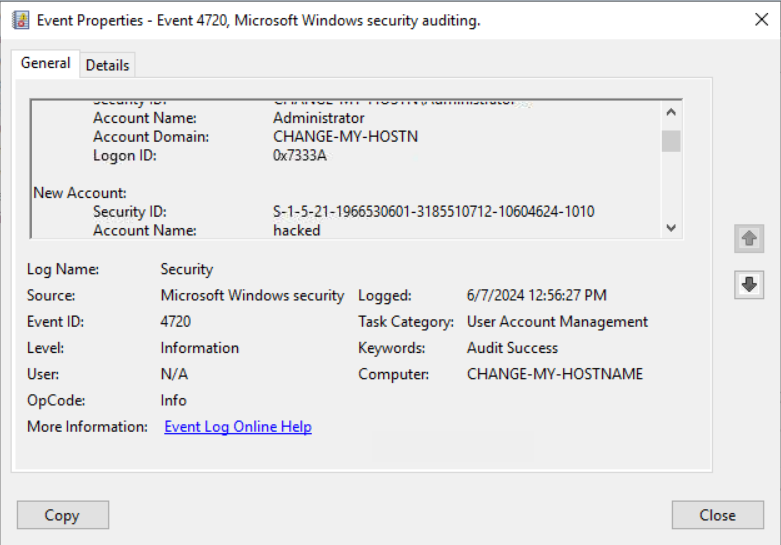
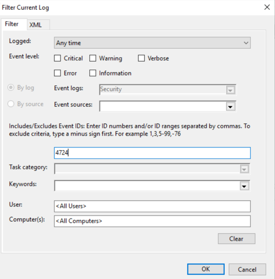
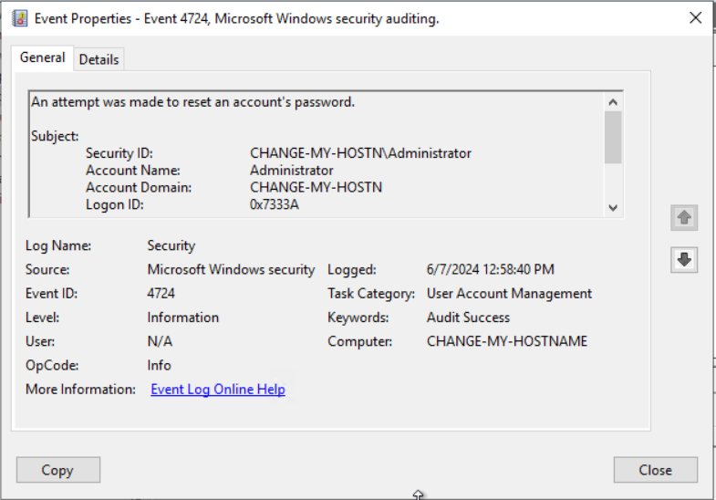

# Windows Log Analysis - Suspicious Account Creation & Credential Manipulation
## Scenario
Following a suspected security event involving unauthorized system access, an investigation was initiated to analyze Windows Security Logs for evidence of attacker activity, including account creation and credential manipulation

## Objectives
- Identify unauthorized account creation
- Detect credential-related modifications
- Reconstruct the attacker activity timeline using Windows Event Logs

## Tools and Data Sources
- Windows Event Viewer
- Windows Security Logs
- Event IDs Analyzed: 4624,4720,4724

## Investigation Process
### Step 1: Filter Security Logs for Account Management Events
- Applied filtering in Event Viewer to isolate relevant Event IDs
- Initially used incorrect Event IDs, resulting in unrelated or empty results
- Refined filtering approach to correctly target account management events
  
### Findings
- Identified **Event ID 4720** indicating creation of a new local account
  
### Analysis
- Accurate Event ID selection is crucial for effective log analysis
- Incorrect filtering can delay investigations and lead to missed indicators

---

### Step 2: Analyze Account Creation Event (Event ID 4720)

- Opened Event Properties and reviewed both **General** and **Details** views
  
### Findings
- A new account was successfully created
- Event logs revealed the account responsible for the creation
  
### Analysis
- Unauthorized account creation indicating potential system compromise
- Suggests attacker may be establishing persistence

---

### Step 3: Investigate Credential Manipulation (Event ID 4724)

- Filtered logs to locate password-related events
- Reviewed Event Properties including XML data
  
### Findings
- Password reset activity detected for an account
  
### Analysis
- Indicates potential attacker attempt to maintain or escalate access
- Credential manipulation is commonly used to secure persistence

---

### Step 4: Validate Log Integrity & Investigation Accuracy
- Reviewed raw event data to ensure consistency of log fields
- Considered variations in how SIEM/EDR tools may parse event data
  
### Analysis
- Direct log analysis provides ground truth beyond tool abstractions
- Critical for building accurate and defensible investigation timelines

---

## Key Findings
- Evidence of unauthorized account creation on the system
- Detection of credential manipulation activity
- Indicators of potential attacker persistence mechanisms
- Initial filtering errors highlighted importance of precise log analysis

--- 

## MITRE ATT&CK Mapping
- [T1136](https://attack.mitre.org/techniques/T1136/) - Create Account
- [T1078](https://attack.mitre.org/techniques/T1078/) - Valid Accounts
- [T1098](https://attack.mitre.org/techniques/T1098/) - Account Manipulation

## Recommendations
- Disable unauthorized accounts immediately
- Reset credentials for affected users
- Enable Advanced Audit Policy for Account Management
- Monitor for additional account-related events
- Validate logs directly when SIEM outputs appear inconsistent

---

## Conclusion
The investigation identified suspicious account creation and credential manipulation activity within Windows Security Logs, indicating potential attacker persistence on the system. Proper log filtering and validation of raw event data were critical in reconstructing the activity timeline and supporting incident response. 

    
